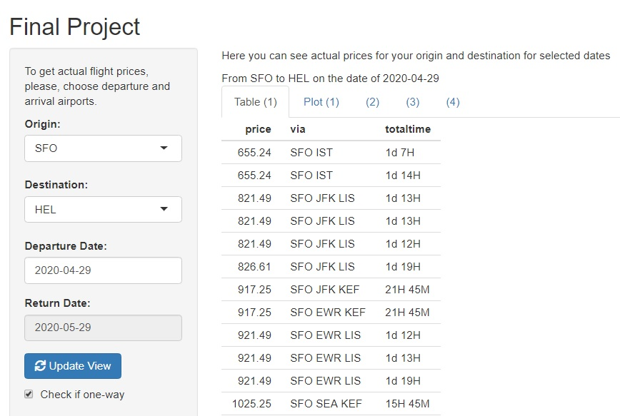

---
output:
  pdf_document: default
  word_document: default
  html_document: default
---
<html>

<head>
<title>Flight Project</title>
</head>

<body>
<h2>In search of better flights</h2>

Amadeus actual database is used. THe application returns actual flight prices based on user input. User can choose departure date and airports

This application retrives actual flight prices and corresponding data from one of the industry recognized flight database Amadeus.

<h2>Amadeus API</h2>

Amadeus provides well-developed API for quering data using https protocol with standard http methods GET and POST. (For working with orders, DELETE method is also used.) If request is successful and response status is 200, the body of response is a JSON object. There are numerous available Amadeus API's providing a veriety of possibilities for searching all kinds of travel offers, creating orders, managing orders and more.

<h2>Project Objectives and Scope</h2>

This project is a deveopment project targeted on creation of web application that allows users (end users and/or agencies) serach offers, browse special offers, create orders, place orders, manipulate orders, make payments, trace statuses, and perfor other related activities.

<h2>
Initial Stage of The Project.  
Development</h2>

At the initial development phase, the structure of data has to be explored. Introductory project stage uses a single API named "Flight Low-fare Search". The structure and the syntax of the requests to this API are described further below (see Authorization). The reponse in a form of JSON includes a set of available offers. "Offers" object consists of a set of inidvidual offers. Each offer has unique information identifying this offer, as well as the information that is essential for customers. These information includes (but not limited to) prices, flight segments, arrival and departe times for each segment, arrival and departure airports for each segments, airport terminal for each airport. For two-way offers, there are two segement sets for each offer.

<h2>Airport Codes and Names</h2>

Airport IATA three letter codes are stored in a file. Ideally, the codes should be received from Amadeus. This functionality is in the project scope, but currently it is not implemented. 

<h2>Authorization</h2>
Thier API uses two-step authorization. At the first step, access token is obtained sending POST request with user credentials (user id and secret code that are received during registration). The body of POST request is similar to GET request parameters string; i.e. it is a string contating name/values pairs ("name=value") separated by "&". At the second step, actual data request is sent using GET method. Two-step authorization provides additional flexibility and security. Access token can be used only once, and there is no need to keep it secret; consequently, data can be received from Amadeus directly by a client, and all JSON processing job could be done on the client side. Client JSON parsing is within the scope of further steps of the project.

<h2>User Interface</h2>

The application has two panels, the left panel and the main panel. On the left panel, there are several controls that allow user input. User can choose departure airport, arrival airport, and departure date. After data input, user can press "Update view" button for the data to passed to the server and then the reponse recived. The reponse is shown in the main panel. The main panel has several tabs. The first tab present all the offers found on Amadeus for given departure and destination airports for selected date. Teh table has three columns including offer price, transit airports for each iterinary, and total time of travel. Total travel time is a difference between the scheduled departure time of the initial leg and scheduled arrival time of the final leg of the trip. There is also a tab showing price distribution as a function of total flight time as a plot.

=================================

.

.

.

.

.

.

.

.

.

.

.

 You can embed an R code chunk like this:

.

.

.

.

.

.

.

.

.

.

.

<!--begin.rcode
summary(cars)
end.rcode-->

You can also embed plots, for example:

<!--begin.rcode fig.width=7, fig.height=6
plot(cars)
end.rcode-->

</body>
</html>
